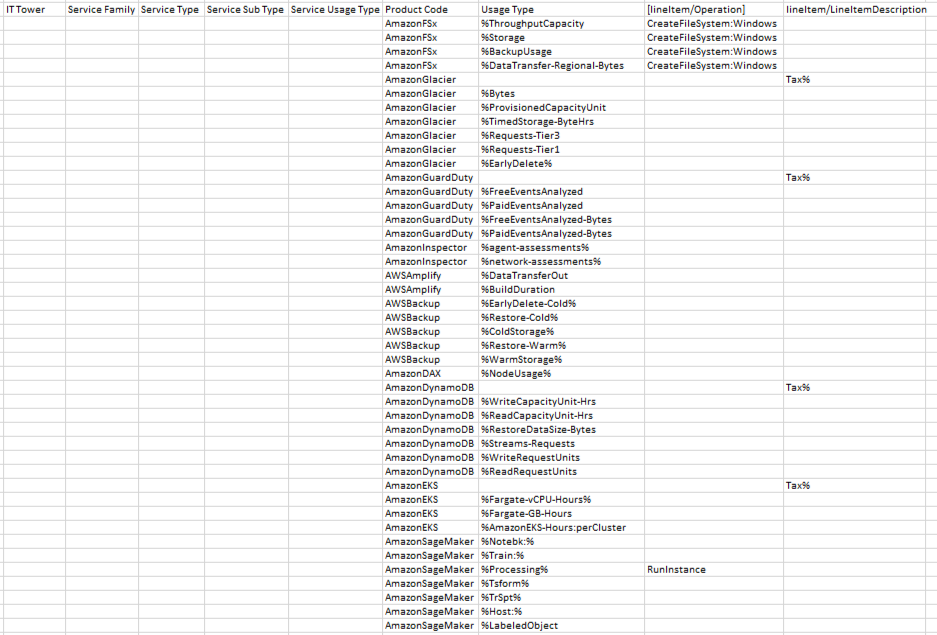

# Лабораторная работа 1. Знакомство с IaaS, PaaS, SaaS сервисами в облаке на примере Amazon Web Services (AWS). Создание сервисной модели.
## Вариант 8
## Выполнили: 
1. Зюзин Владислав
2. Недиков Никита
3. Проскуряков Роман
## Цель работы:
```
1. Знакомство с облачными сервисами. 
2. Понимание уровней абстракции над инфраструктурой в облаке. 
3. Формирование понимания типов потребления сервисов в сервисной-модели. 
```
## Задание:
```
1. Импортировать файл .csv в Excel или любую другую программу работы с таблицами. 
2. Распределить потребление сервисов по иерархии, чтобы можно было провести анализ от большего к меньшему. 
```
## Выполнение работы:
1. Изначально нам был предоставлен файл, содержащий часть данных биллинга провайдера в формате .csv файла. Необходимо было сопоставить уже имеющиеся данные от провайдера с документацией Amazon. Исходные данные можно увидеть на скрине.
   

   
2. В ходе задания требовалось заполнить таблицу, классифицировав сервисы по их типам и подтипам. Описание этих параметров представлено ниже в таблице.
   
| <!-- -->      | <!-- -->        | 
|:-------------:|:---------------|
| **IT Tower**       | Группа, ответственная за управление инфраструктурой сервиса, его поддержку и характеристики. Примеры: Хранение данных, Машинное обучение, Базы данных, Безопасность, Аналитика, Вычисления.| 
| **Service Family**          | Группа сервисов, выполняющих конкретные инфраструктурные задачи и связанных с определённым приложением. Примеры: Сервисы приложений, Управление или предоставление ресурсов, Ускорение на базе GPU, Сервис кэширования в памяти, Сервис обнаружения угроз и др.| 
| **Service Type**          | Категория сервиса в рамках определённой группы сервисов. Примеры: Elastic File System, Elastic Inference, ElastiCache, GuardDuty, Kinesis и др.| 
| **Service Sub Type**  |Более детализированный подтип сервиса с конкретной функцией. Примеры: Плата, Ускорение, Узлы кэша, Безопасность и соответствие и др.|
|**Service Usage Type** |Тип использования сервиса с учётом подтипа (определяет, какие запросы может выполнять пользователь с помощью данного сервиса). Примеры: Стандартное временное хранилище, Хранилище с редким доступом, Налоги и др.|
---

3.	Далее были выделены сервисы в соответствии с исходными данными. Нами были выделены: AmazonFSx, AmazonGlacier, AmazonGuardDuty, AmazonInspector, AWSAmplify, AWSBackup, AmazonDAX, AmazonDynamoDB, AmazonEKS и AmazonSageMaker.

#### Ниже представлено описание всех выделенных нами сервисов: 
```Amazon Elastic File System``` – это полностью управляемый облачный сервис хранения файлов. Он предлагает пользователям высокодоступное файловое хранилище для использования с облачными сервисами AWS и локальными ресурсами. Он разработан для обеспечения возможности хранения файлов в очень большом количестве случаев, таких как разработка приложений, сайтов, обработка данных и многих других. Amazon Elastic File System обеспечивает автоматическую масштабируемость, высокую пропускную способность, быструю работу с любым количество данных, гибкость, а также безопасность данных. 

```Amazon Elastic Inference``` – это сервис, который позволяет оптимизировать производительность и повысить эффективность нагрузок, связанных с машинным обучением.  

```Amazon ElastiCache``` – это полностью управляемый сервис кэширования данных в памяти, предназначенный для повышения масштабируемости приложений за счет хранения часто используемых данных в памяти. 

```Amazon GuardDuty``` – это сервис, специализирующийся на обнаружении угроз. Он позволяет отслеживать вашу среду на предмет вирусов и вредоносной активности и обеспечивают защиту учетных записей и рабочих нагрузок. 

```Amazon Kinesis``` – это сервис, предназначенный для сбора и анализа потоковых данных в режиме реального времени. Эта платформа предоставляет возможность сбора и анализа в любых масштабах из множества источников. 

```Amazon Kendra``` – это сервис, специализирующийся на поиске информации с помощью алгоритмов искусственного интеллекта. Он предоставляет поиск различных типов данных внутри организации и обеспечивает высокую точность и эффективность. 

```Amazon Lex``` – это сервис, предназначенный для создания разговорных чат-ботов и голосовых виртуальных помощников с помощью алгоритмов искусственного интеллекта. Этот сервис предоставляет возможность создания ботов, способных обрабатывать вводимые данные, понимать намерения и генерировать ответы пользователям. 

```Amazon Lightsail``` – это сервис, который облегчает запуск частных серверов в облаке Amazon и позволяет управлять ими. Он создан специально для немногочисленных групп пользователей/частных лиц. 

```Amazon Redshift``` – полностью управляемый сервис, предназначенный для хранения данных, их анализа и выполнения сложных аналитических запросов. Этот сервис специализируется на больших объемах данных и позволяет повысить производительность во время работы с ними. 

```Amazon Route 53``` – это сервис, который позволяет управлять трафиком доменных имен и направлять его для приложений и внутренних ресурсов.   
```Проведем анализ с сервисами Yandex.Cloud:```
AmazonElastiCache - Yandex Managed Service for Redis

AmazonES - Yandex Managed Service for Elasticsearch

AmazonQLDB - Аналог Yandex.Cloud Неть

awskms - Yandex Key Management Service

CloudHSM - Аналог Yandex.Cloud Неть

AmazonRekognition - Yandex Vision

AmazonTextract - Yandex Vision

AmazonLex - Yandex SpeechSense

AWSCodePipeline - Аналог Yandex.Cloud Неть

AmazonSES - Yandex Postbox

AmazonSNS - Аналог Yandex.Cloud Неть

### Результат работы
Результат нашей работы представлен в виде таблицы:

### Вывод
В результате выполнения данной лабораторной работы была сформирована и заполнена таблица с данными из документации Amazon. Были проанализированы и описаны 10 сервисов, а также получены данные о подтипах этих сервисов и других характеристиках.   
Также была достигнута цель нашей работы - было сформировано понимание типов потребления сервисов в сервисной модели.  
