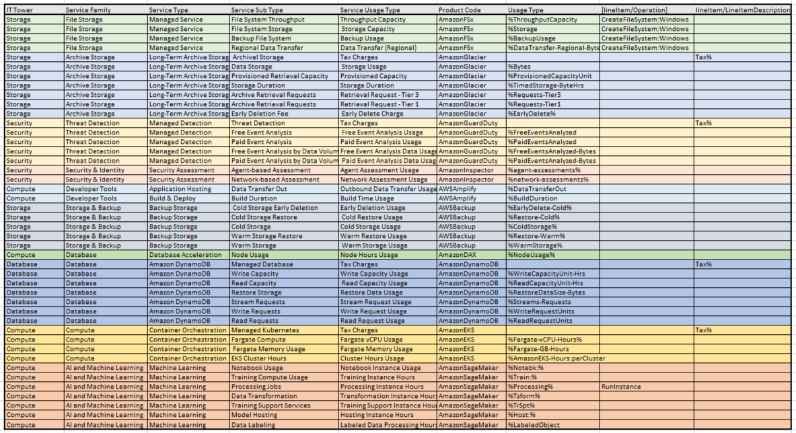

# Лабораторная работа 1. Знакомство с IaaS, PaaS, SaaS сервисами в облаке на примере Amazon Web Services (AWS). Создание сервисной модели.
## Вариант 8
## Выполнили: 
1. Зюзин Владислав
2. Недиков Никита
3. Проскуряков Роман
## Цель работы:
```
1. Знакомство с облачными сервисами. 
2. Понимание уровней абстракции над инфраструктурой в облаке. 
3. Формирование понимания типов потребления сервисов в сервисной-модели. 
```
## Задание:
```
1. Импортировать файл .csv в Excel или любую другую программу работы с таблицами. 
2. Распределить потребление сервисов по иерархии, чтобы можно было провести анализ от большего к меньшему. 
```
## Выполнение работы:
1. Изначально нам был предоставлен файл, содержащий часть данных биллинга провайдера в формате .csv файла. Необходимо было сопоставить уже имеющиеся данные от провайдера с документацией Amazon. Исходные данные можно увидеть на скрине.
   

   
2. В ходе задания требовалось заполнить таблицу, классифицировав сервисы по их типам и подтипам. Описание этих параметров представлено ниже в таблице.
   
| <!-- -->      | <!-- -->        | 
|:-------------:|:---------------|
| **IT Tower**       | Группа, ответственная за управление инфраструктурой сервиса, его поддержку и характеристики. Примеры: Хранение данных, Машинное обучение, Базы данных, Безопасность, Аналитика, Вычисления.| 
| **Service Family**          | Группа сервисов, выполняющих конкретные инфраструктурные задачи и связанных с определённым приложением. Примеры: Сервисы приложений, Управление или предоставление ресурсов, Ускорение на базе GPU, Сервис кэширования в памяти, Сервис обнаружения угроз и др.| 
| **Service Type**          | Категория сервиса в рамках определённой группы сервисов. Примеры: Elastic File System, Elastic Inference, ElastiCache, GuardDuty, Kinesis и др.| 
| **Service Sub Type**  |Более детализированный подтип сервиса с конкретной функцией. Примеры: Плата, Ускорение, Узлы кэша, Безопасность и соответствие и др.|
|**Service Usage Type** |Тип использования сервиса с учётом подтипа (определяет, какие запросы может выполнять пользователь с помощью данного сервиса). Примеры: Стандартное временное хранилище, Хранилище с редким доступом, Налоги и др.|
---

3.	Далее были выделены сервисы в соответствии с исходными данными. Нами были выделены: AmazonFSx, AmazonGlacier, AmazonGuardDuty, AmazonInspector, AWSAmplify, AWSBackup, AmazonDAX, AmazonDynamoDB, AmazonEKS и AmazonSageMaker.

## Описание всех выделенных сервисов: 
### Amazon FSx
Это полностью управляемый облачный сервис хранения файлов для Windows. Он предлагает пользователям высокодоступное файловое хранилище для использования с облачными сервисами AWS и локальными ресурсами. Он разработан для обеспечения возможности хранения файлов в очень большом количестве случаев, таких как разработка приложений, сайтов, обработка данных и многих других. Amazon FSx обеспечивает автоматическую масштабируемость, высокую пропускную способность, быструю работу с любым количеством данных, гибкость, а также безопасность данных.

### Amazon Glacier
Это долговременный архивный сервис для хранения данных, который предлагает высокую доступность и безопасность при низких затратах. Он идеально подходит для хранения редко используемых данных, таких как архивы, видео, изображения и другие типы данных.

### Amazon GuardDuty
Это сервис, специализирующийся на обнаружении угроз. Он позволяет отслеживать вашу среду на предмет вирусов и вредоносной активности и обеспечивает защиту учетных записей и рабочих нагрузок.

### Amazon Inspector
Это сервис, который помогает оценить безопасность и соответствие требованиям для приложений и ресурсов AWS. Он анализирует конфигурацию ресурсов и сравнивает ее с лучшими практиками безопасности и требованиями соответствия.

### AWS Amplify
Это сервис, который помогает ускорить разработку, развертывание и масштабирование мобильных и веб-приложений. Он предлагает инструменты и функции для создания, тестирования и развертывания приложений.

### AWS Backup
Это сервис, который помогает создавать резервные копии данных и ресурсов AWS. Он предлагает централизованное управление резервными копиями и восстановлением данных.

### Amazon DAX
Это полностью управляемый сервис кэширования в памяти, предназначенный для повышения производительности приложений. Он идеально подходит для приложений, которые требуют высокой производительности и низкой задержки.

### Amazon DynamoDB
Это полностью управляемый сервис базы данных NoSQL, который предлагает высокую производительность, масштабируемость и доступность. Он идеально подходит для приложений, которые требуют высокой производительности и низкой задержки.

### Amazon EKS
Это сервис, который помогает запускать и управлять контейнерами Kubernetes в AWS. Он предлагает высокую доступность, масштабируемость и безопасность для контейнерных приложений.

### Amazon SageMaker
Это сервис, который помогает разработчикам и ученым создавать, обучать и развертывать модели машинного обучения. Он предлагает полностью управляемую среду для машинного обучения, которая включает в себя инструменты для подготовки данных, обучения моделей и развертывания их в производственной среде.


### Результат работы
Результат нашей работы представлен в виде таблицы:

### Вывод
В результате лабораторной работы были проанализированы и описаны 10 сервисов, а также получены данные о подтипах этих сервисов и других характеристиках. Кроме того, была достигнута цель работы — сформировано понимание типов потребления сервисов в сервисной модели.
