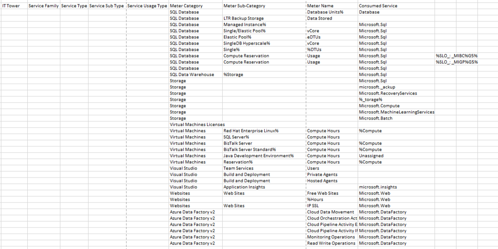

# Лабораторная работа 2. Сравнение сервисов Amazon Web Services и Microsoft Azure. Создание единой кросс-провайдерной сервисной модели.
## Вариант 7
## Работу выполнили: 
1. Зюзин Владислав
2. Недиков Михаил
3. Проскуряков Роман
## Цель работы:
```
Знакомство с облачными сервисами.
Понимание уровней абстракции над инфраструктурой в облаке.
Формирование понимания типов потребления сервисов в сервисной-модели. 
```
## Задание:
```
Импортировать файл .csv в Excel или любую другую программу работы с таблицами.
Распределить потребление сервисов по иерархии, чтобы можно было провести анализ от большего к меньшему.
```
## Выполнение работы:
1.	Изначально был предоставлен файл, содержащий часть данных биллинга провайдера в формате .csv файла. Необходимо было сопоставить уже имеющиеся данные от провайдера с документацией Amazon. Исходные данные можно увидеть на скрине.


2.	Далее нужно было заполнить таблицу, классифицировав сервисы по их типам и подтипам. Описание этих параметров представлено ниже в таблице.

| <!-- -->      | <!-- -->        | 
|:-------------:|:---------------|
|**IT Tower**|Группа, отвечающая за управление инфраструктурой сервиса, его поддержку и характеристику.|
|**Service Family**|Группа сервисов, предназначенных для выполнения конкретной инфраструктурной задачи и связанных с определённым приложением.|
|**Service Type**|Тип сервиса в рамках определённой группы сервисов.|
|**Service Sub Type**|Уточнённый подтип сервиса, обладающий определённой функцией.|
|**Service Usage Type**|Тип использования сервиса с учётом его подтипа, который определяет, какие запросы может выполнять пользователь с помощью данного сервиса.|
---
Далее выделяем сервисы в соответствии с исходными данными. Были выделены: Azure SQL Database, Azure SQL Data Warehouse, Azure Storage, Azure Virtual Machines Licenses, Azure Virtual Machines, Azure Visual Studio, Azure Websites, Azure Data Factory v2. Ниже представлено описание всех выделенных нами сервисов: 

### Azure SQL Database
Azure SQL Database – это облачный реляционный сервис базы данных, предназначенный для хранения данных и управления ими. Этот сервис предоставляет возможность работать с реляционными базами данных без необходимости управлять физической инфраструктурой.

**Основные преимущества:**
- **Масштабируемость** – позволяет автоматически или вручную масштабировать вычислительные мощности и объемы хранения в зависимости от нагрузки.
- **Высокая доступность** – обеспечивает встроенные механизмы репликации и резервирования для гарантии надежной работы баз данных.
- **Безопасность** – предоставляет встроенные функции шифрования, управления доступом и автоматического обновления для защиты данных пользователя.

---

### Azure SQL Data Warehouse
Azure SQL Data Warehouse – это облачный аналитический сервис для хранения и обработки больших объемов данных. Он предоставляет возможности для выполнения сложных запросов и аналитики данных.

**Основные особенности:**
- **Масштабируемость** – сервис позволяет динамически увеличивать или уменьшать мощности хранения и вычислений.
- **Интеграция** – поддерживает интеграцию с различными инструментами аналитики, такими как Power BI и Azure Data Factory.
- **Оптимизация производительности** – разделение ресурсов хранения и вычислений обеспечивает высокую производительность запросов.

---

### Azure Storage
Azure Storage – это облачный сервис, предоставляющий надежное и масштабируемое хранилище данных для приложений и сервисов. Он поддерживает различные типы хранения данных, такие как блоб-объекты, файлы, очереди и таблицы.

**Основные преимущества:**
- **Долговременное хранение** – подходит для резервного копирования, архивирования и хранения больших объемов данных.
- **Масштабируемость** – позволяет адаптировать объем хранения под потребности пользователя.
- **Безопасность** – данные шифруются как при передаче, так и при хранении.

---

### Azure Virtual Machines Licenses
Azure Virtual Machines Licenses – это лицензии, предоставляемые для использования виртуальных машин в облаке Azure. Они включают поддержку различных операционных систем и корпоративного программного обеспечения.

**Основные преимущества:**
- **Гибкость** – позволяет пользователю выбрать лицензию, подходящую для его задач, включая BYOL (Bring Your Own License).
- **Интеграция** – совместимость с сервисами Microsoft, такими как Windows Server и SQL Server.
- **Экономичность** – возможность использования резервированных лицензий для снижения стоимости.

---

### Azure Virtual Machines
Azure Virtual Machines – это сервис, предоставляющий виртуальные машины, которые можно настраивать и использовать для выполнения любых задач, от простых приложений до сложных вычислительных задач.

**Основные функции:**
- **Гибкость** – поддержка различных операционных систем и широкого спектра конфигураций виртуальных машин.
- **Масштабируемость** – возможность увеличивать или уменьшать ресурсы в зависимости от нагрузки.
- **Интеграция** – поддержка интеграции с другими сервисами Azure, такими как Azure Monitor и Azure Storage.

---

### Azure Visual Studio
Azure Visual Studio – это набор облачных инструментов и сервисов, предоставляющих мощные средства для разработки, тестирования и деплоя приложений.

**Основные преимущества:**
- **Централизованное управление** – доступ к инструментам разработки, интегрированным с Azure.
- **Поддержка DevOps** – возможность использования Azure DevOps для управления жизненным циклом приложений.
- **Масштабируемость** – поддержка распределенной разработки и совместной работы в команде.

---

### Azure Websites
Azure Websites – это облачный сервис, позволяющий разрабатывать, разворачивать и масштабировать веб-приложения.

**Основные функции:**
- **Мультиплатформенность** – поддержка различных языков программирования, таких как .NET, PHP, Node.js и Python.
- **Автоматическое масштабирование** – возможность адаптировать ресурсы под текущие нагрузки.
- **Безопасность** – встроенная поддержка SSL и управление доступом для защиты веб-приложений.

---

### Azure Data Factory v2
Azure Data Factory v2 – это облачный сервис, предназначенный для интеграции данных и оркестрации рабочих процессов обработки данных.

**Основные особенности:**
- **Интеграция данных** – поддержка работы с различными источниками данных, включая локальные и облачные.
- **Оркестрация** – автоматизация сложных процессов передачи и обработки данных.
- **Гибкость** – возможность создания кастомизированных рабочих процессов через визуальный интерфейс или код.

## Результат работы:
Результат нашей работы представлен в виде таблицы на скрине:  

## Вывод:
В данной лабораторной работе наша команда столкнулась с трудностями понимания документации Microsoft Azure. В отличие от Amazon, где все было довольно понятно, в этой работе мы далеко не сразу поняли, как нам выполнить работу.
 
В целом, данная лабораторная работа позволила нам расширить наши знания о облачных сервисах и познакомиться с платформой Azure.  
