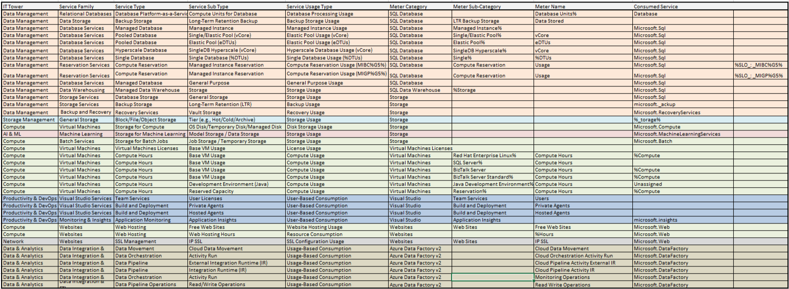

# Лабораторная работа 2. Сравнение сервисов Amazon Web Services и Microsoft Azure. Создание единой кросс-провайдерной сервисной модели.
## Вариант 7
## Работу выполнили: 
1. Зюзин Владислав
2. Недиков Михаил
3. Проскуряков Роман
## Цель работы:
1. Знакомство с облачными сервисами.
2. Понимание уровней абстракции над инфраструктурой в облаке.
3. Формирование понимания типов потребления сервисов в сервисной-модели. 
## Задание:
1. Импортировать файл .csv в Excel или любую другую программу работы с таблицами.
2. Распределить потребление сервисов по иерархии, чтобы можно было провести анализ от большего к меньшему.
## Выполнение работы:
1.	Изначально был предоставлен файл, содержащий часть данных биллинга провайдера в формате .csv файла. Необходимо было сопоставить уже имеющиеся данные от провайдера с документацией Amazon. Исходные данные можно увидеть на скрине.

2.	Далее нужно было заполнить таблицу, классифицировав сервисы по их типам и подтипам. Описание этих параметров представлено ниже в таблице.

| **Название**           | **Описание**                                                                                         |
|-------------------------|-----------------------------------------------------------------------------------------------------|
| **IT Tower**            | Команда, которая занимается управлением инфраструктурой сервиса, его поддержкой и обеспечением стабильности. |
| **Service Family**      | Набор сервисов, объединённых для выполнения определённых инфраструктурных задач и связанных с конкретным приложением. |
| **Service Type**        | Категория сервиса внутри определённой группы, определяющая его основные функции.                   |
| **Service Sub Type**    | Более узкая специализация сервиса, описывающая его конкретные возможности и задачи.                 |
| **Service Usage Type**  | Тип использования сервиса, учитывающий его особенности и определяющий, какие действия доступны пользователю. |
---
Далее выделяем сервисы в соответствии с исходными данными. Были выделены: Azure SQL Database, Azure SQL Data Warehouse, Azure Storage, Azure Virtual Machines Licenses, Azure Virtual Machines, Azure Visual Studio, Azure Websites, Azure Data Factory v2. Ниже представлено описание всех выделенных нами сервисов: 

### Azure SQL Database  
Azure SQL Database – это облачный сервис реляционных баз данных, который позволяет хранить и управлять данными без необходимости управления физической инфраструктурой. Он упрощает работу с базами данных, предоставляя готовые решения для обеспечения их производительности, безопасности и доступности.  

Сервис поддерживает автоматическое масштабирование вычислительных мощностей и объемов хранения, что позволяет адаптироваться под любые нагрузки. Azure SQL Database обеспечивает высокий уровень доступности благодаря встроенным механизмам репликации и резервирования, а также гарантирует безопасность данных с помощью шифрования и инструментов управления доступом.

---

### Azure SQL Data Warehouse  
Azure SQL Data Warehouse – это облачный аналитический сервис для хранения и обработки больших объемов данных. Он создан для выполнения сложных аналитических запросов и работы с большими массивами данных в режиме реального времени.  

Этот сервис позволяет динамически изменять мощности хранения и вычислений, что делает его удобным для гибкой обработки данных. Azure SQL Data Warehouse интегрируется с инструментами, такими как Power BI и Azure Data Factory, обеспечивая удобство работы с аналитикой. Благодаря разделению ресурсов хранения и вычислений сервис обеспечивает высокую производительность запросов даже при значительных объемах данных.

---

### Azure Storage  
Azure Storage – это масштабируемое облачное хранилище, которое поддерживает множество типов данных, включая блоб-объекты, файлы, таблицы и очереди. Оно идеально подходит для резервного копирования, архивирования и работы с большими объемами информации.  

Сервис предлагает пользователям гибкость в масштабировании хранилища в зависимости от потребностей, долговременное хранение данных и надежные механизмы их защиты. Для обеспечения безопасности данные шифруются как при передаче, так и при хранении.

---

### Azure Virtual Machines Licenses  
Azure Virtual Machines Licenses предоставляют пользователям лицензии для работы с виртуальными машинами в облаке Azure. Эти лицензии поддерживают широкий спектр операционных систем и корпоративных программных решений, таких как Windows Server и SQL Server.  

Пользователи могут выбирать наиболее подходящие лицензии, включая опцию BYOL (Bring Your Own License). Azure Virtual Machines Licenses предлагают гибкость в лицензировании, интеграцию с другими продуктами Microsoft и экономичные тарифы на резервированные лицензии.

---

### Azure Virtual Machines  
Azure Virtual Machines – это сервис для создания и управления виртуальными машинами в облаке, который подходит как для простых приложений, так и для выполнения сложных вычислительных задач.  

Сервис поддерживает множество операционных систем и конфигураций, позволяя пользователям выбирать подходящие параметры под свои задачи. Azure Virtual Machines обеспечивает автоматическое масштабирование ресурсов в зависимости от нагрузки, а также интеграцию с другими сервисами, такими как Azure Monitor и Azure Storage, для повышения производительности и удобства управления.

---

### Azure Visual Studio  
Azure Visual Studio – это набор инструментов и сервисов для разработки, тестирования и развертывания приложений в облаке. Он позволяет разработчикам использовать мощные возможности Azure для упрощения процесса создания и управления проектами.  

Инструменты Azure Visual Studio поддерживают интеграцию с Azure DevOps, обеспечивая централизованное управление разработкой и совместную работу команд. Сервис подходит как для индивидуальных разработчиков, так и для распределенных команд, предоставляя масштабируемые решения для любых задач.

---

### Azure Websites  
Azure Websites – это облачная платформа для разработки, развертывания и масштабирования веб-приложений. Она поддерживает различные языки программирования, такие как .NET, PHP, Python и Node.js.  

Сервис автоматически масштабирует ресурсы в зависимости от нагрузки, что делает его удобным для приложений с переменной активностью. Встроенные функции, такие как поддержка SSL и управление доступом, обеспечивают высокий уровень безопасности для веб-приложений.

---

### Azure Data Factory v2  
Azure Data Factory v2 – это сервис для интеграции данных и автоматизации процессов их обработки. Он позволяет объединять данные из различных источников, включая локальные и облачные хранилища, и создавать сложные рабочие процессы.  

Сервис предоставляет визуальный интерфейс для создания потоков обработки данных, а также возможность работы через код. Благодаря гибкости и поддержке интеграции с другими сервисами Azure, Azure Data Factory v2 подходит для задач любой сложности, связанных с обработкой данных.

## Результат работы:
Результат нашей работы представлен в виде таблицы на скрине:  

## Вывод:

В ходе выполнения лабораторной работы наша команда столкнулась с трудностями в понимании документации Microsoft Azure. В отличие от Amazon, где информация была представлена более понятно, здесь нам потребовалось время, чтобы разобраться, как выполнить задание.

В целом, эта лабораторная работа позволила нам углубить знания об облачных сервисах и познакомиться с платформой Azure.
