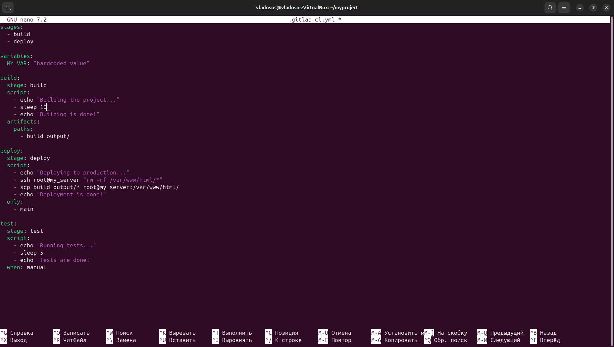

# Лабораторная работа № 3

## Техническое задание
* Сначала пишем “плохой” **CI/CD** файл, который работает, но в нем есть не менее пяти “bad practices” по написанию CI/CD файла
* Написать “хороший” **CI/CD** файл, в котором эти плохие практики исправлены

## Выполнили студенты:
* Зюзин Владислав 
* Недиков Михаил
* Проскуряков Роман

## Начинаем делать лабу
При первом открытии лабы мы впали в неудержимое желание разобраться, что такое CI/CD и с чем его едят...

## Что такое CI/CD
В разработке ПО, **CI/CD** или **CICD** — это комбинация непрерывной интеграции и непрерывного развертывания программного обеспечения в процессе разработки. **CI/CD** объединяет разработку, тестирование и развёртывание приложений. В настоящий момент DevOps-программисты стремятся применять CI/CD практически для всех задач. (Хорошие вещи похожи: CI/CD и AC/DC, главное не путать :))

## Выполнение лабы
Для начала разбираемся как писать CI/CD файл, узнаем про его структуру/компоненты.

### Bad CI/CD practice

Рассмотрим файл CI/CD:

### Для того, чтобы было понятно, что не так, распишем следующие неудобства:

1. **Хардкодированные значения**: В переменной `MY_VAR` хранится хардкодированное значение `"Bad CI/CD practice"`. Так делать не слудует, ввиду того, что хардкодированные значения могут быть трудными для апдейтов и управления.
2. **Хардкодированные учетные данные SSH**: В стадии `deploy` используются жестко закодированные учетные данные SSH (`root@my_server`), что является небезопасной практикой, поскольку такие данные могут быть уязвимы для кибератак и хацкеров.
3. **Безопасное удаление файлов**: В стадии `deploy` команда `rm -rf /var/www/html/*` удаляет все файлы в директории `/var/www/html/` без запроса подтверждения, что может привести к случайному удалению важных файлов.
4. **Ручное запуск тестов**: В стадии `test` используется условие `when: manual`, которое требует ручного запуска тестов, что может привести к пропуску тестов и снижению качества кода.
