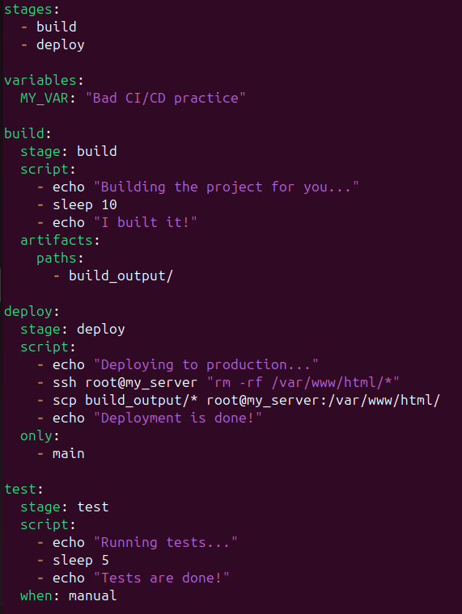

# Лабораторная работа № 3

## Техническое задание
* Сначала пишем “плохой” **CI/CD** файл, который работает, но в нем есть не менее пяти “bad practices” по написанию CI/CD файла
* Написать “хороший” **CI/CD** файл, в котором эти плохие практики исправлены

## Выполнили студенты:
* Зюзин Владислав 
* Недиков Михаил
* Проскуряков Роман

## Начинаем делать лабу
При первом открытии лабы мы впали в неудержимое желание разобраться, что такое CI/CD и с чем его едят...

## Что такое CI/CD
В разработке ПО, **CI/CD** или **CICD** — это комбинация непрерывной интеграции и непрерывного развертывания программного обеспечения в процессе разработки. **CI/CD** объединяет разработку, тестирование и развёртывание приложений. В настоящий момент DevOps-программисты стремятся применять CI/CD практически для всех задач. (Хорошие вещи похожи: CI/CD и AC/DC, главное не путать :))

## Выполнение лабы
Для начала разбираемся как писать CI/CD файл, узнаем про его структуру/компоненты.

### Bad CI/CD practice

Рассмотрим файл CI/CD:

