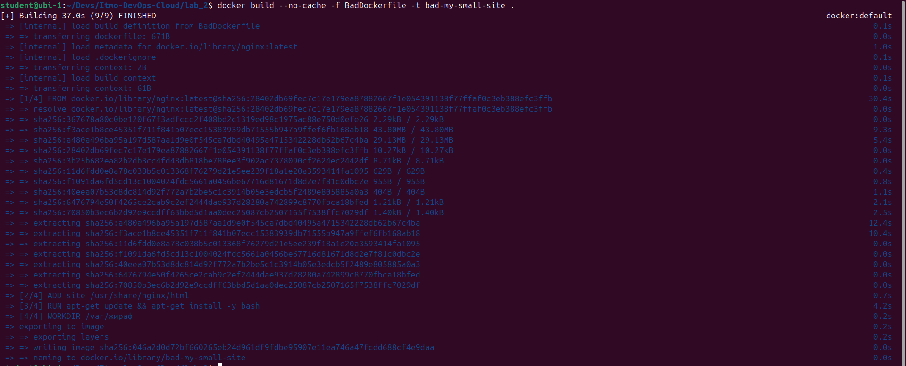
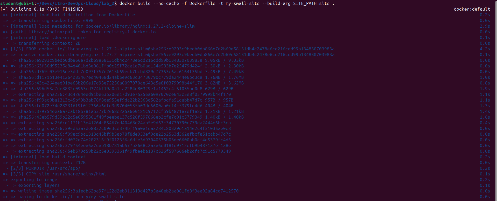
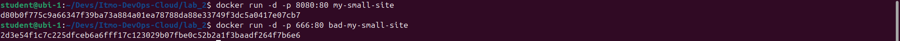
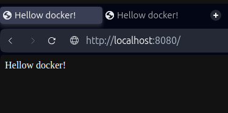
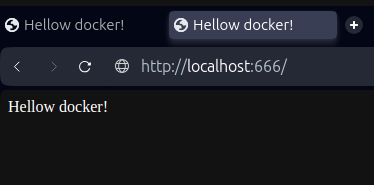

# Лабораторная работа №2

Выполнили: Недиков Михаил, Проскуряков Роман и Зюзин Владислав

## Техническое задание

1. Написать “плохой” Dockerfile, в котором есть не менее трех “bad practices” по написанию докерфайлов
2. Написать “хороший” Dockerfile, в котором эти плохие практики исправлены
3. В Readme описать каждую из плохих практик в плохом докерфайле, почему она плохая и как в хорошем она была исправлена, как исправление повлияло на результат
4. В Readme описать 2 плохих практики по работе с контейнерами. ! Не по написанию докерфайлов, а о том, как даже используя хороший докерфайл можно накосячить именно в работе с контейнерами.

## Шаги решения

- Установка docker
- Создание простого сайта, который мы будем хостить
- Написание "плохого" и "хорошего" Dockerfile-ов
- Создание образов
- Запуск контейнеров и проверка появления сайта
- Сравнение Dockerfile-ов
- Описание двух плохих практики по работе с контейнерами

## Система

- Ubuntu 24.04.1 LTS


## Установка docker

Установка происходила по данной [инструкции](https://timeweb.cloud/tutorials/docker/kak-ustanovit-docker-na-ubuntu-22-04). Ничего особенного, просто копируем и вставляем по порядку.

После установки для дальнейшей работы с докером необходимо добавить права для нашего user-а на работу с докером. Для этого добавим его в группу <b>docker<b>. 

Выполняем:

```bash
sudo usermod -aG docker $USER
```

и выходим из сессии, затем входим в систему снова.

Можно было бы конечно запускать докер и под root, но, как будет сказано в конце, это плохая практика. 

## Создание простого сайта, который мы будем хостить

Создали отдельную папочку <b>site<b> для файлов, копируемых в образ докер файла.

В ней для примера создадим "Hellow word" на html, и будем надеяться увидеть его после запуска контейнера.

<b>index.xtml<b>

```html
<!DOCTYPE html>
<html>
    <head>
        <title>Hellow docker!</title>
    </head>
    <body>
          Hellow docker!
    </body>
</html>

```

## Написание "плохого" и "хорошего" Dockerfile-ов

Рядом с нашей папочкой <b>site<b> создадим два Docker файла. Назовём из BadDockerfile и Dockerfile.

<b>Плохой BadDockerfile<b>

```docker
# Используем не оптимальный образ Nginx последней версии
FROM nginx:latest

# Используем ADD вместо COPY без необходимости
ADD site /usr/share/nginx/html

# Скачиваем что-то не используемое 
RUN apt-get update && apt-get install -y bash

# Устанавливаем непонятную рабочую директорию
WORKDIR /var/жираф

# Открываем порт 80
EXPOSE 80

# Запускаемся от root-пользователя
USER root

# Запускаем Nginx
CMD ["nginx", "-g", "daemon off;"]
```

<b>Хорошенький Dockerfile<b>

```
# Используем лёгкий образ Nginx статичной версии 
FROM nginx:1.27.2-alpine-slim

# устанавливаем рабочую директорию
WORKDIR /usr/src/app/

# Открываем порт 80
EXPOSE 80

# Копируем только нужные файлы сайта в директорию Nginx
ARG SITE_PATH
COPY $SITE_PATH /usr/share/nginx/html

# Используем не root пользователя для безопасности (не требуется в nginx образе)
# RUN adduser -D myuser && chown -R myuser ./
# USER myuser

# Запускаем Nginx
CMD ["nginx", "-g", "daemon off;"]

```

## Создание образов

Теперь перед запуском контейнеров мы должны собрать образы докер файлов. Для этого используется команда ```docker build```

Перейдём в консоли в папку с нашими докер файлами.

- Чтобы указать какой файл собирать используется аргумент <b>-f<b> и за ним путь к файлу. 
- Для указания названия образа аналогично используется тег <b>-t<b>. 
- Ключ <b>--no-shash<b> запрещает использовать кеш для сборки образа, что может исключить неожиданные баги.
- В конце ставим точку!

Соберём наш BadDockerfile

```
docker build --no-cache -f BadDockerfile -t bad-my-small-site .
```



И теперь Dockerfile
Не забываем, что мы в качестве дополнительного параметра передаём ещё и относительный путь к нашему сайту. Для этого используем ```--build-arg SITE_PATH=site```

```
docker build --no-cache -f Dockerfile -t my-small-site --build-arg SITE_PATH=site .
```




## Запуск контейнеров и проверка появления сайта

Для запуска используется команда ```docker run containerName```

- ключ <b>-d<b> запускает контейнер в фоновом режиме и выводи его id.
- ключ <b>-p<b> пробрасывает порт контейнера на host.

Запускаем оба, но на разных портах: хороший на 8080, плохой на 666.

```
docker run -d -p 8080:80 my-small-site
```

```
docker run -d -p 666:80 bad-my-small-site
```



Переходим на <http://localhost:8080/> и видим наш привет.



Переходим на <http://localhost:666/> - та же картина.



## Сравнение Dockerfile-ов

Перечислим плохие практики, используемые в BadDockerfile:
1. Используем не оптимальный (излишний) образ Nginx:latest ```FROM nginx:latest```
Такой подход увеличивает время сборки контейнера (с 8 до 37 секунд), его размер, добавляет вместе с дополнительным ПО дополнительные уязвимости, и из-за версии latest может неожиданно перестать работать после очередной сборки, при том, что в самом файле ничего не изменялось.

2. Используем ADD вместо COPY без необходимости ```ADD site /usr/share/nginx/html```
COPY и ADD похожи по функционалу, но считается хорошей практикой везде, где не требуется функционал работы с архивами и сетевыми файлами использовать COPY. Это должно быть быстрее

3. Скачиваем что-то не используемое ```RUN apt-get update && apt-get install -y bash```
В контейнерах принято устанавливать минимальное возможное количество программ для исключения тех недостатком, что перечислены в пункте 1.

4. Устанавливаем непонятную рабочую директорию ```WORKDIR /var/жираф```
WORKDIR в данном случае применяется для ухудшения читаемости и логичности, хотя создана для обратного. К тому же это может вызвать проблемы из за латиницы

5. Запускаемся от root-пользователя ```USER root```
Запуск под root считается плохой практикой из за проблем с безопасностью. Если злоумышленник сможет попасть в наш контейнер, то у него будет прямой доступ в root пользователя нашей хостовой ОС.

6. Захардкоженый путь к нашему сайту ```ADD site /usr/share/nginx/html```
Если нам захочется изменить название папки с сайтом, то придётся редактировать файл сборки, что не очень удобно.

Исправим всё и получим Dockerfile
1. Маленький родительский образ с минимальным функционалом и статичной(всегда работающей) версией```FROM nginx:1.27.2-alpine-slim```
2. Интуитивный путь к рабочей директории ```WORKDIR /usr/src/app/```
3. Путь до сайта вынесен в отдельный аргумент сборки ```ARG SITE_PATH```
4. Ещё за хорошую практику считают размещать команды в порядке увеличения шанса их изменения (если это не влияет на функционал). Таким образом, при изменении файла хешируемая часть остаётся больше, и время сборки уменьшается.

Работа с контейнерами стала быстрее и удобнее.

## Описание двух плохих практики по работе с контейнерами

1. Как упоминалось ранее, не стоит запускать контейнеры и собирать образы из под пользователя root. Зачастую, все внутренние команды контейнера будут выполняться от этого же имени что может вызвать проблемы с безопасностью.
2. Моментальная замена всех старых версий контейнеров на новые с выходом новой версии образа. В этом случае, есть вероятность, что абсолютно всё перестанет работать. Чтобы избежать этого стоит обновлять контейнеры постепенно, при выявлении проблем решать их, не мешая работе всей системы в целом.


## Ресурсы

[Установка docker](https://timeweb.cloud/tutorials/docker/kak-ustanovit-docker-na-ubuntu-22-04)
