# Лабораторная работа №2 со звёздочкой
## Задание
* Написать “плохой” Docker compose файл, в котором есть не менее трех “bad practices” по их написанию.
* Написать “хороший” Docker compose файл, в котором эти плохие практики исправлены.
* В хорошем файле настроить сервисы так, чтобы контейнеры в рамках этого compose-проекта поднимались вместе, но не "видели" друг друга по сети.

## Выполнили студенты
* Зюзин Владислав
* Недиков Михаил 
* Поскуряков Роман

## Установка Docker compose

Первым делом устанавливаем Docker, если ещё не установили, лучший гайд по установке представлен на видео по ссылке: https://yandex.ru/video/preview/3719090281561281090  
После этого устанавливаем Docker compose на ОС. В нашем случае это Linux, а именно Ubuntu:24.04, которую мы запускаем через VirtualBox.
Не забываем проверить обновления, благодаря вводу команды: 
```
sudo apt get update
```
Далее уже можно установить Docker compose, введём поочерёдно команды:
```
mkdir -p ~/.docker/cli-plugins/
```
```
curl -SL https://github.com/docker/compose/releases/download/v2.27.0/docker-compose-linux-x86_64 -o ~/.docker/cli-plugins/docker-compose
```
```
chmod +x ~/.docker/cli-plugins/docker-compose
```
На рисунке ниже представлен код и его вывод, а так же проверка установки Docker compose

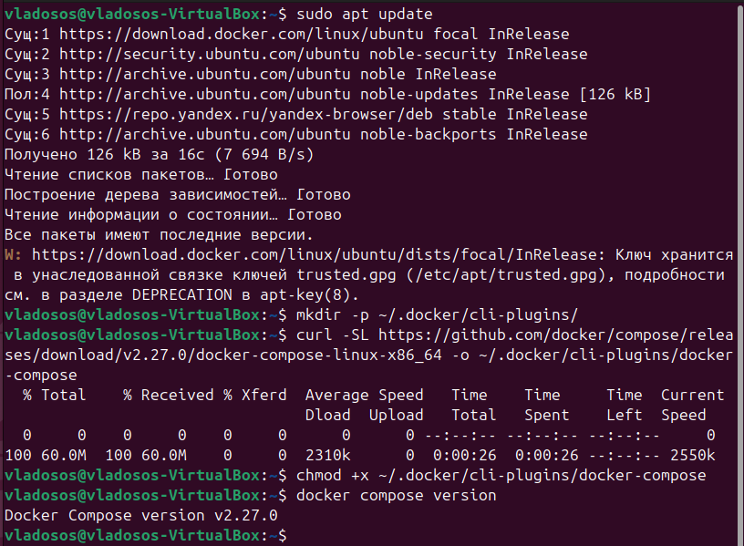

## Написание Docker compose файла

### Пара слов про Docker compose

Docker Compose — это инструмент, предназначенный для удобного управления контейнерами Docker. Он особенно полезен для работы со средами, в которых задействовано несколько контейнеров, но также подходит для управления отдельными контейнерами. С его помощью можно изолировать окружения, одновременно запускать, пересобирать и останавливать контейнеры, отслеживать их состояние и пользоваться множеством других полезных функций, упрощающих работу с контейнерами.

### Как с ним работать?

Начнём с базовового, нужно создать пределённую папку, в которую вы сложите свои скрипты, а так же docker-compose файл, который будет запускать их. mkdir script1 script2
С помощью команд
```
mkdir lab2*
```
после переходим через `cd lab2*` в созданную директорию
```
mkdir bad
```
посмотрим на то, что мы сделали ранее и переходим в нужную директорию.
Мы создали директорию, в которой будем хранить скрипты и запускать `docker-compose.yml.`. Далее создаём директории для скриптов: 
``` 
mkdir script1 script2
```
Заходим поочерёдно в директории, вводим в терминал команду: 
```
gedit script1.bash
```
Мы внесли следующий код: 
```
#!/bin/bash

echo "Container 1 is working!"
ping -c 2 8.8.8.8
```
Почему пинг? Потому что в последнем задании нам предстоит проверять связь между докерами, т.о. мы создали два сервиса, которые выполняют простой скрипт на языке bash, который сначала выводит в консоль сообщение о том, что контейнер работает, а также его номер, а потом с помощью утилиты ping проверяет соединение с интернетом.

По аналогии заодим в script2, создаём и заполняем файл `script1.bash` следующим кодом: 
```
#!/bin/bash

echo "Container 2 is working!"
ping -c 2 8.8.8.8
```
Далее возвращаемся в директорию `\lab2*\bad\`, там создаём `docker-compose.yml`, в который заносим такой код: 

```
version: '2'
services:
  My_cont_1:
    image: ubuntu:latest  
    privileged: true  
    volumes:
      - ./script1:/container_folder  
    command: >
      /bin/bash -c
      "apt-get update && apt-get install -y bash &&
      apt-get install -y iputils-ping && bash /container_folder/script1.bash"

  My_cont_2:
    image: ubuntu:latest  
    privileged: true  
    volumes:
      - ./script2:/container_folder  
    command: >
      /bin/bash -c
      "apt-get update && apt-get install -y bash &&
      apt-get install -y iputils-ping && bash /container_folder/script2.bash"
```
### Кстати, почему же он плохой?
**1. Использование тега `latest` для образа**

*Непредсказуемость*: Тег latest всегда будет ссылаться на последнюю доступную версию образа. Это может привести к тому, что в будущем версия образа изменится, и ваш контейнер будет строиться на совершенно другой версии с новыми зависимостями и поведением.

*Отсутствие контроля*: Использование latest нарушает принцип стабильности и управляемости. Когда образ обновляется, он может неожиданно повлиять на ваш проект, изменив его поведение.

*Проблемы с совместимостью*: На разных машинах может быть установлена разная версия Docker, и использование latest может привести к различным версиям образа на разных системах, что усложнит тестирование и поддержку проекта.

**2. Запуск контейнера с привилегиями (privileged: true)**

*Риски безопасности*: Когда контейнер запускается с привилегиями, он получает доступ ко всем устройствам и ресурсам хостовой машины, что увеличивает вероятность использования контейнера для атаки на хост. Привилегированные контейнеры могут выполнять операции, которые не должны быть доступны в обычных контейнерах, такие как монтирование устройств или доступ к чувствительным данным хоста.

*Нарушение изоляции*: Одной из главных целей использования контейнеров является изоляция процессов. Включение привилегий нарушает эту изоляцию и может привести к сбоям в работе хостовой системы или другим контейнерам.

*Необходимость в привилегиях*: Использование привилегированного режима следует избегать, если нет веской причины для его использования. В большинстве случаев контейнеру не нужно таких прав для выполнения обычных задач.

**3. Монтирование локальных файлов без правильных прав доступа**

*Конфликт прав доступа*: Локальные файлы и директории на хосте могут иметь права доступа, несовместимые с контейнером. Например, если файлы на хосте доступны только для чтения, а контейнер попытается их изменить, это приведет к ошибке. Это может создать дополнительные сложности при работе в разных средах.

*Безопасность и уязвимости*: Когда контейнер монтирует локальные файлы с хоста, это увеличивает вероятность утечек данных или доступа к уязвимым файлам. Если контейнер не ограничен в доступе к этим файлам, он может выполнить несанкционированные операции на хосте.

*Нарушение переносимости*: Монтирование локальных файлов с хоста делает контейнер менее переносимым. В других средах или на других машинах, где структура директорий или права доступа могут отличаться, это может вызвать проблемы.


### Полезные команды

Во время лабораторной работы пришлось воспользоваться командой:

```
sudo docker system prune
```

Это чтобы докеры не скушали вашу память, про докер в огоньком было актутуально.

```
clear
```

Это если вы совсем заспамили свой терминал.

Так же, бесплатныый совет, нужно помнить и смотреть в каких файлах вы что либо насоздавали, а так же, какие имена скриптов вы указываете в docker-compose.yml. Можете сэкономить порядочно времени.

### Вернёмся к плохому Docker compose
Теперь, что достаточно полезно - введите команды: 
```
chmod +x ~/lab2*/bad/script1/script1.bash
```
```
chmod +x ~/lab2*/bad/script2/script2.bash
```
Это нужно, чтобы ваши скрипты имели 100500% шанс на выполнение, они, оказывается, не всегда имеют на это право, крч, введите и не парьтесь.

Ну и наконец, то, на что было потрачено где то часа 2, вводим эту команду:
```
sudo docker compose up
```
И наблюдаем результат: 

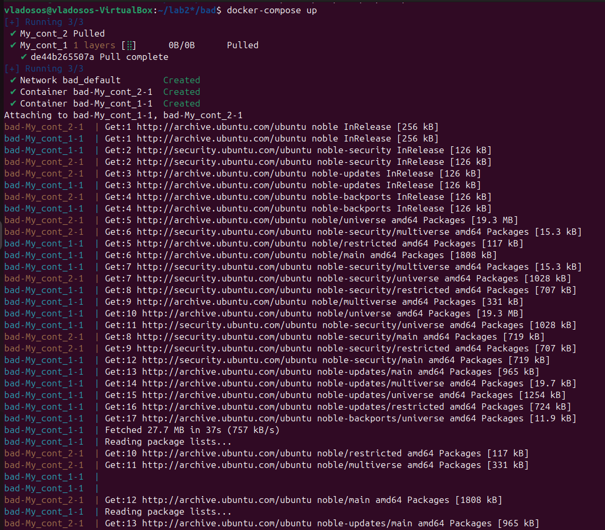
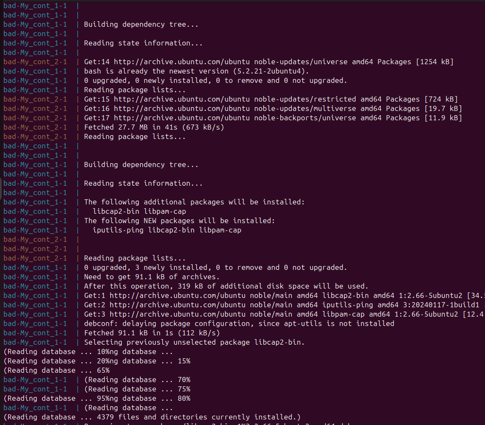
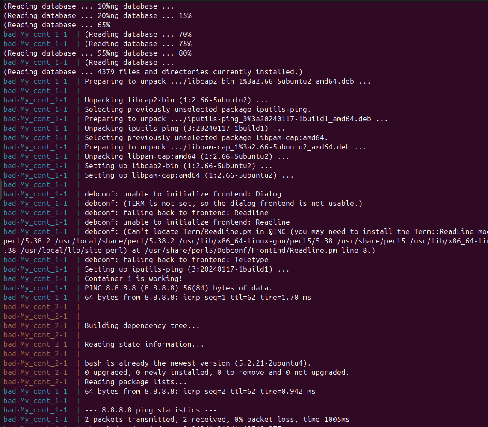
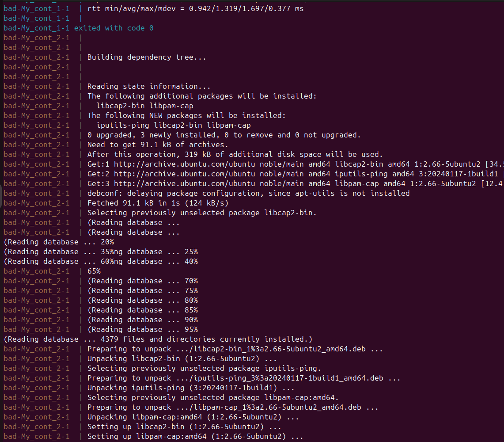
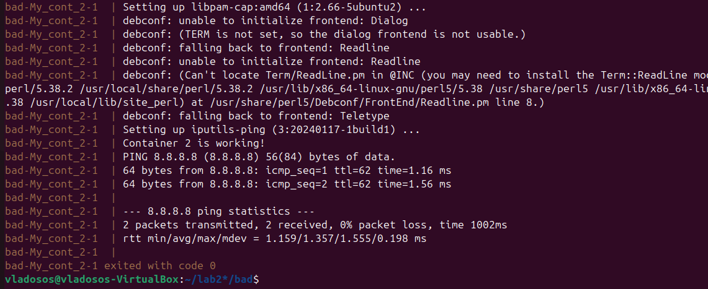

Как мы видим, работа прошла без ошибок, мы связали контейнеры, мы молодцы.

## Хороший Docker compose файл
После успешного успеха с плохим `docker-compose.yml`, мы пофиксили плохие практики на хорошие и наш `docker-compose.yml` выглядит следующим образом:
```
version: '2'
services:
  My_cont_1:
    image: ubuntu:22.04  
    privileged: false  
    volumes:
      - ./script1:/container_folder:ro  
    command: >
      /bin/bash -c
      "apt-get update && apt-get install -y bash &&
      apt-get install -y iputils-ping && bash /container_folder/script1.bash"

  My_cont_2:
    image: ubuntu:22.04  
    privileged: false  
    volumes:
      - ./script2:/container_folder:ro  
    command: >
      /bin/bash -c
      "apt-get update && apt-get install -y bash &&
      apt-get install -y iputils-ping && bash /container_folder/script2.bash"
```
Файлы со скриптами мы не меняли.

### Что мы исправили в плохих практиках

По порядку опишем решения.

```
image: ubuntu:22.04
```

1. Тег :latest был заменён на конкретную версию 22:04. Теперь система будет запускаться всегда одинаковая. Она стала более стабильной.

```
privileged: false
```

2. Контейнер теперь запускается без привилегий. Значит он не может повлиять на работу хоста.

```
./script1:/container_folder:ro
```

3. Флаг :ro (read only). Это гарантирует, что контейнер будет иметь доступ к смонтированным файлам только для чтения, что повышает безопасность хоста, предотвращая изменение или повреждение данных.

Покажем, что хороший Docker compose так же работает.

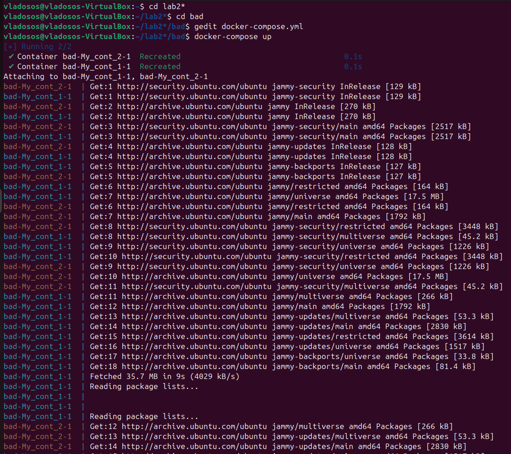
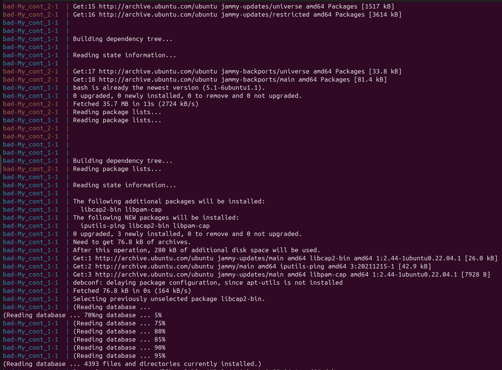
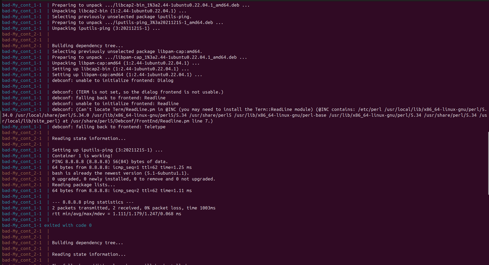
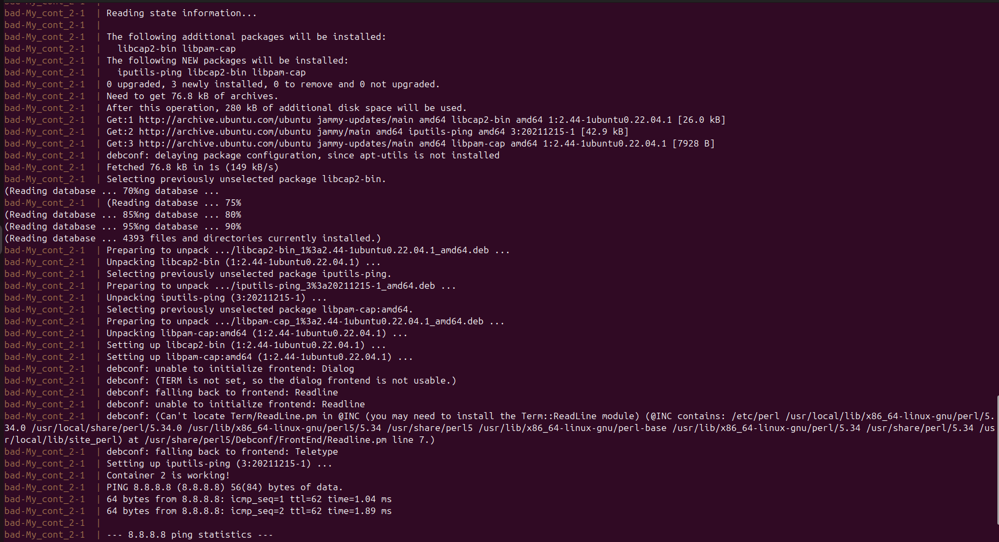
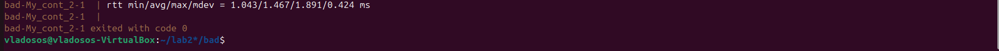

## Настройка сервисов для достижения изоляции работающих контейнеров друг от друга
**Цель этой части работы:** Настроить сервисы так, чтобы контейнеры в рамках одного Docker Compose проекта поднимались одновременно, но не могли взаимодействовать друг с другом по сети.
Прежде всего хочется отметить, что мы переименовали директорию вместо: `bad` у нас `docker_container`. Там, мы изменили `docker-compose.yml`, он стал выглядеть следующим образом: 
```
version: '2'
services:
  My_cont_1:
    image: ubuntu:22.04
    privileged: false
    volumes:
      - ./script1:/container_folder:ro
    command: >
      /bin/bash -c
      "apt-get update && apt-get install -y bash &&
      apt-get install -y iputils-ping && bash /container_folder/script1.bash"
    networks:
      - net1

  My_cont_2:
    image: ubuntu:22.04
    privileged: false
    volumes:
      - ./script2:/container_folder:ro
    command: >
      /bin/bash -c
      "apt-get update && apt-get install -y bash &&
      apt-get install -y iputils-ping && bash /container_folder/script2.bash"
    networks:
      - net2

networks:
  net1:
    driver: bridge
  net2:
    driver: bridge
```
В файле мы реализовали слелующие моменты, отличающие `docker-compose.yml` от того, что было ранее:

1. Сервисы: My_cont_1 и My_cont_2 поднимаются одновременно.

2. Сети: My_cont_1 подключён к сети net1, а My_cont_2 подключён к сети net2.

3. Каждая сеть использует драйвер bridge для обеспечения изоляции. 

Так же мы видоизменили скрипты, уже в большей степени для удовлетворения потребностей к прекрасному.

Так выглядит `script1.bash`

```
#!/bin/bash

echo "Контейнер 1: Проверка доступности внешних ресурсов."
ping -c 4 8.8.8.8

echo "Контейнер 1: Выполняю задачи..."
sleep 5

echo "Контейнер 1: Задачи завершены."
```
А так `script2.bash`

```
#!/bin/bash

echo "Контейнер 2: Проверка доступности внешних ресурсов."
ping -c 4 8.8.8.8

echo "Контейнер 2: Выполняю задачи..."
sleep 5

echo "Контейнер 2: Задачи завершены."
```
Наконец, после изменений в docker compose и скриптах наших сервисов нам требуется проверить работоспособность всего того, что мы сделали, вводим команду:
```
docker-compose up
```
Наш результат получился следующим: 

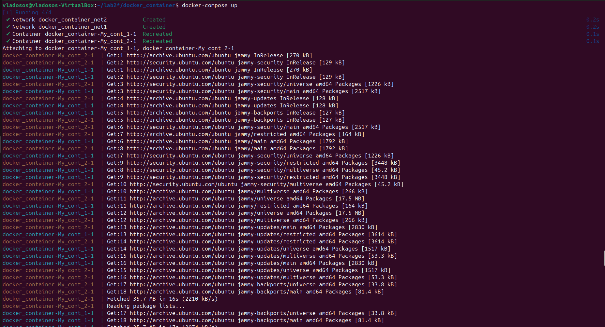
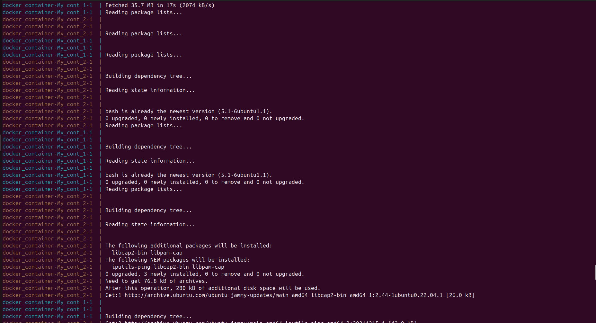
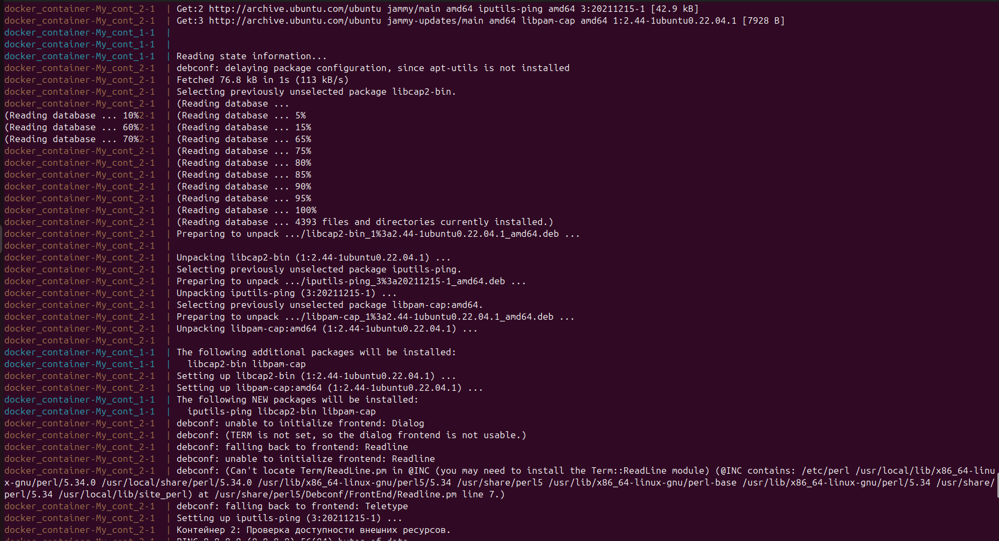
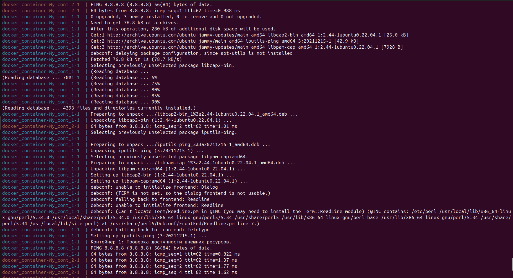
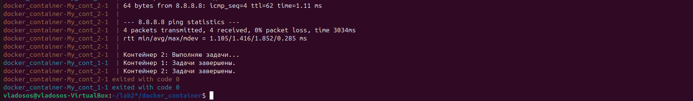

В итоге нам удалось настроить сервисы так, чтобы контейнеры в рамках одного Docker Compose проекта поднимались одновременно, но не могли взаимодействовать друг с другом по сети. 

## Опишем принцип сетевой изоляции в Docker
### Bridge-сети в Docker

Каждая сеть (net1 и net2) создана с драйвером `bridge`. Этот драйвер предоставляет возможность изолировать контейнеры, подключённые к разным сетям.

### Изоляция на уровне проекта

- Контейнеры подключены только к своим отдельным сетям.
- В рамках одной сети контейнеры могут обмениваться данными, но при нахождении в разных сетях взаимодействие блокируется.

### Реализация в проекте

- `My_cont_1` и `My_cont_2` подключены к `net1` и `net2` соответственно.
- Это исключает возможность прямого сетевого взаимодействия между контейнерами.

### Преимущества подхода

#### Изоляция

Полное отсутствие взаимодействия между контейнерами предотвращает случайный или злонамеренный доступ к данным.

#### Безопасность

Внешние сети изолированы, что минимизирует риски перехвата данных.

## Заключение
В рамках выполнения задачи настроены два контейнера, которые поднимаются одновременно, но находятся в изолированных сетевых пространствах. Это достигнуто путём подключения каждого контейнера к отдельной bridge-сети в Docker. Все настройки и скрипты протестированы, их работоспособность подтверждена.
