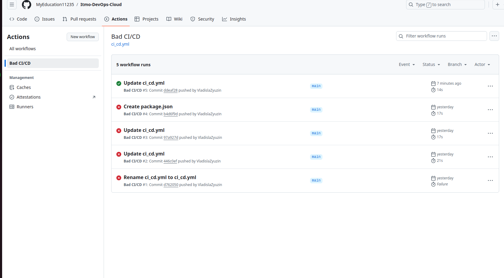
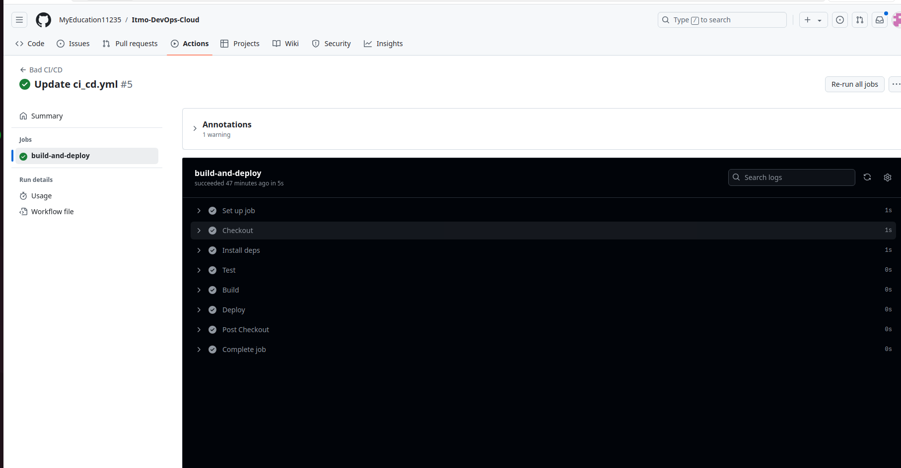
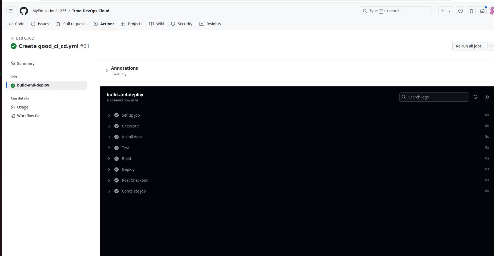

# Лабораторная работа № 3

## Техническое задание
* Сначала пишем “плохой” **CI/CD** файл, который работает, но в нем есть не менее пяти “bad practices” по написанию CI/CD файла
* Написать “хороший” **CI/CD** файл, в котором эти плохие практики исправлены

## Выполнили студенты:
* Зюзин Владислав 
* Недиков Михаил
* Проскуряков Роман

## Начинаем делать лабораторной работы
При первом открытии лабы мы впали в неудержимое желание разобраться, что такое CI/CD и с чем его едят...


## Что такое CI/CD
В разработке ПО, **CI/CD** или **CICD** — это комбинация непрерывной интеграции и непрерывного развертывания программного обеспечения в процессе разработки. **CI/CD** объединяет разработку, тестирование и развёртывание приложений. В настоящий момент DevOps-программисты стремятся применять CI/CD практически для всех задач. (Хорошие вещи похожи: CI/CD и AC/DC, главное не путать :))

## Выполнение лабы
Для начала разбираемся как писать CI/CD файл, узнаем про его структуру/компоненты.

### Bad CI/CD practice

Рассмотрим файл CI/CD с "**плохими практиками**":

Для начала работы мы создали небольшой проект, который обозвали `package.json`, который имееет следующий вид:
```
{
  "name": "your-project-name",
  "version": "1.0.0",
  "description": "",
  "main": "index.js",
  "scripts": {
    "test": "echo \"Error: no test specified\" && exit 0",
    "build": "echo \"Building...\"",
    "deploy": "echo \"Deploying...\""
  },
  "keywords": [],
  "author": "",
  "license": "ISC"
}
```

Его следует добавить в корень репозитория, т.е. в ветку `main`, чтобы в Githab Actions у нас всё заработало.

После этого весёлого процесса, созаём CICD файл, я его назвал: `ci_cd.yml`, создав при этом в ветке `main` файл `.github/workflows` и поместив туда CICD, у нас он выглядит слудеющим образом:
```
name: Bad CI/CD

on:
  push:
    branches:
      - main

jobs:
  build-and-deploy:
    runs-on: ubuntu-latest
    steps:
      - name: Checkout
        uses: actions/checkout@v3

      - name: Install deps
        run: npm install

      - name: Test
        run: npm run test

      - name: Build
        run: npm run build

      - name: Deploy
        run: |
           echo "Deploying..."
```

### Для того, чтобы было  более понятно, что не так, распишем следующие неудобства:

1. **Отсутствие кэширования зависимостей**. Почему это плохо: Каждый раз, когда запускается pipeline, npm install заново устанавливает все зависимости, что замедляет процесс.
2. **Запуск на каждой правке в ветке `main`** Почему это плохо: Выполнение CI/CD при каждом пуше в main приводит к перегрузке, особенно если правки частые. Обычно тесты и сборка запускаются на pull request (PR) перед слиянием в `main`.
3. **Отсутствие проверок при деплое** Почему это плохо: Пропуск проверки успешного завершения предыдущих шагов может привести к деплою сломанного билда.
4. **Отсутствие уведомлений о статусе выполнения pipeline** Почему это плохо: При сбоях в пайплайне вы не будете получать уведомления и не сможете оперативно реагировать на ошибки.
5. **Отсутствие управления секретами** Почему это плохо: Если деплой требует секретов (например, API-ключей), их нельзя хранить напрямую в коде или в pipeline. Это риск для безопасности.

Вот так выглядит успешный успех после нескольких часов и дней работы, как мы видим, пайплайн успешно запустился, все стадии были выполнены:



Так выглядит сам пайплайн:



### Good CI/CD practices

Для выполнения этой работы мы использовали тот же проект, но для него написали изменённый CICD файл, мы его назвали `good_ci_cd.yml` и поместили его в `.github/workflows`, как и предыдущий CICD.

### Вот так будет выглядеть обновленный CI/CD:

```
name: Good CI/CD

on:
  pull_request:
    branches:
      - main

jobs:
  build-and-test:
    runs-on: ubuntu-20.04  # Ограничение версии ОС

    steps:
      - name: Checkout repository
        uses: actions/checkout@v3

      - name: Set up Node.js
        uses: actions/setup-node@v3
        with:
          node-version: '16'  # Указание версии Node.js

      - name: Cache npm dependencies
        uses: actions/cache@v3
        with:
          path: ~/.npm
          key: ${{ runner.os }}-node-${{ hashFiles('**/package-lock.json') }}
          restore-keys: |
            ${{ runner.os }}-node-

      - name: Install dependencies
        run: npm install

      - name: Run tests
        run: npm run test

      - name: Build project
        run: npm run build

```

**Объяснение улучшений:**

1. **Исправление триггера**: запуск pipeline только для pull request вместо каждого пуша в `main`.
2. **Ограничение версии ОС**: явное указание версии Ubuntu для предотвращения ошибок из-за изменений в последних версиях ОС.
3. **Указание версии Node.js**: явное указание версии Node.js для предотвращения несовместимости.
4. **Кеширование зависимостей**: добавление кеширования npm зависимостей для ускорения работы pipeline.
5. **Условия для деплоя**: деплой выполняется только при успешных тестах, что предотвращает нежелательные ошибки.


### Вот так будет выглядеть новый успешный успех, а точнее, пайплайн:



## Заключение
1. "Плохой" CI/CD файл мы написан 5 bad practices объяснены
2. "Хороший" CI/CD файл мы написали исправленные 5 bad practices донесены до сведения


Теперь пустим все деньги со степендии на это)
