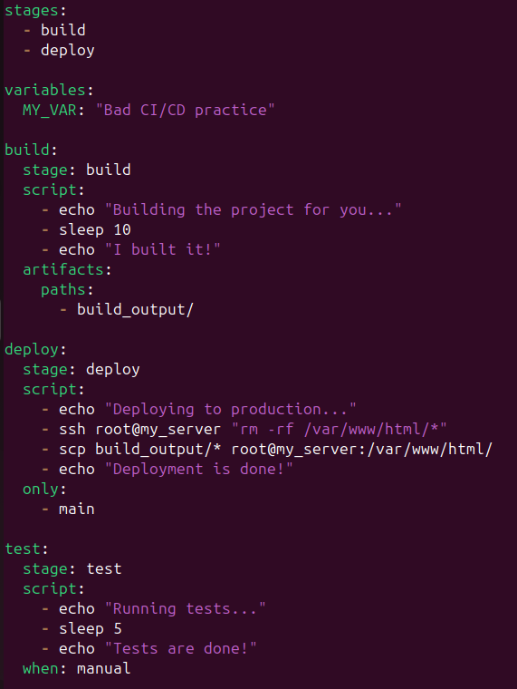
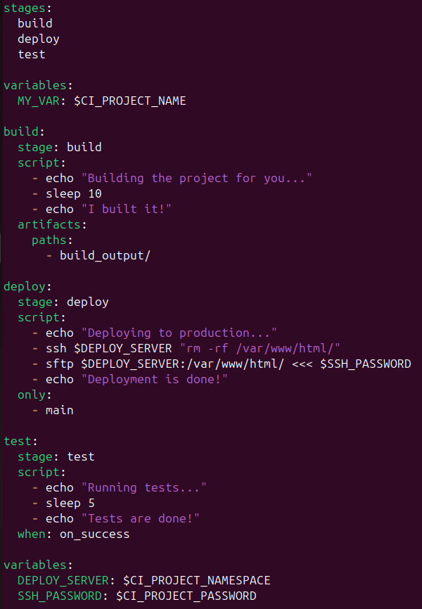

# Лабораторная работа № 3

## Техническое задание
* Сначала пишем “плохой” **CI/CD** файл, который работает, но в нем есть не менее пяти “bad practices” по написанию CI/CD файла
* Написать “хороший” **CI/CD** файл, в котором эти плохие практики исправлены

## Выполнили студенты:
* Зюзин Владислав 
* Недиков Михаил
* Проскуряков Роман

## Начинаем делать лабораторной работы
При первом открытии лабы мы впали в неудержимое желание разобраться, что такое CI/CD и с чем его едят...

## Что такое CI/CD
В разработке ПО, **CI/CD** или **CICD** — это комбинация непрерывной интеграции и непрерывного развертывания программного обеспечения в процессе разработки. **CI/CD** объединяет разработку, тестирование и развёртывание приложений. В настоящий момент DevOps-программисты стремятся применять CI/CD практически для всех задач. (Хорошие вещи похожи: CI/CD и AC/DC, главное не путать :))

## Выполнение лабы
Для начала разбираемся как писать CI/CD файл, узнаем про его структуру/компоненты.

### Bad CI/CD practice

Рассмотрим файл CI/CD с "**плохими практиками**":

Для начала работы я создал небольшой проект, который обозвал `package.json`, который имееет следующий вид:
``
{
  "name": "your-project-name",
  "version": "1.0.0",
  "description": "",
  "main": "index.js",
  "scripts": {
    "test": "echo \"Error: no test specified\" && exit 0",
    "build": "echo \"Building...\"",
    "deploy": "echo \"Deploying...\""
  },
  "keywords": [],
  "author": "",
  "license": "ISC"
}
``

### Для того, чтобы было  более понятно, что не так, распишем следующие неудобства:

1. **Хардкодированные значения**: В переменной `MY_VAR` хранится хардкодированное значение `"Bad CI/CD practice"`. Так делать не следует, ввиду того, что хардкодированные значения могут быть трудными для апдейтов и управления.
2. **Хардкодированные учетные данные SSH**: В стадии `deploy` используются жестко закодированные учетные данные SSH (`root@my_server`), что является небезопасной практикой, поскольку такие данные могут быть уязвимы для кибератак и хацкеров.
3. **Безопасное удаление файлов**: В стадии `deploy` команда `rm -rf /var/www/html/*` удаляет все файлы в директории `/var/www/html/` без запроса подтверждения, что может привести к случайному удалению важных файлов.
4. **Ручное запуск тестов**: В стадии `test` используется условие `when: manual`, которое требует ручного запуска тестов, что может привести к пропуску тестов и снижению качества кода.
5. **Отсутствие обработки ошибок**: В файле `.gitlab-ci.yml` отсутствует `explicit` обработка ошибок, что может привести к тому, что конвейер не будет останавливаться при возникновении ошибок, что может привести к дальнейшим проблемам.
6. **Небезопасный протокол передачи файлов**: В стадии `deploy` используется команда `scp`, которая не является безопасным протоколом передачи файлов. Рекомендуется использовать более безопасные протоколы, такие как SFTP или rsync. (`deploy`, кстати, ещё можно перенести в stages, но об этом дальше)

### Good CI/CD practices чётко и по порядку
Итак, что же было изменено и почему они "**хорошие**"

1. **Хардкодированные значения**: Переменная `MY_VAR` теперь использует динамическое значение `$CI_PROJECT_NAME` вместо хардкодированного значения.

2. **Хардкодированные учетные данные SSH**: Учетные данные SSH теперь хранятся в переменных `DEPLOY_SERVER` и `SSH_PASSWORD`, а не хардкодированы в файле.

3. **Удаление файлов без подтверждения**: Команда `rm -rf` теперь использует переменную `DEPLOY_SERVER` для удаления файлов на сервере.

4. **Ручное тестирование**: Тесты теперь запускаются автоматически при успешном выполнении предыдущих стадий с помощью условия when: `on_success`.

5. **Deploy в stages**: Перенос deploy в раздел stages позволяет нам явно определить порядок выполнения стадий конвейера, таким образом наши стадии выполняются последовательно.

6. **Использование не безопасного протокола переноса файлов**: Команда `scp` была заменена на `sftp`, который является более безопасным протоколом передачи файлов.

### Вот так будет выглядеть обновленный CI/CD:

## Заключение
1. "Плохой" CI/CD файл мы написан 6 bad practices объяснены
2. "Хороший" CI/CD файл мы написали исправленные 6 bad practices донесены до сведения

Теперь пустим все деньги со степендии на это)
